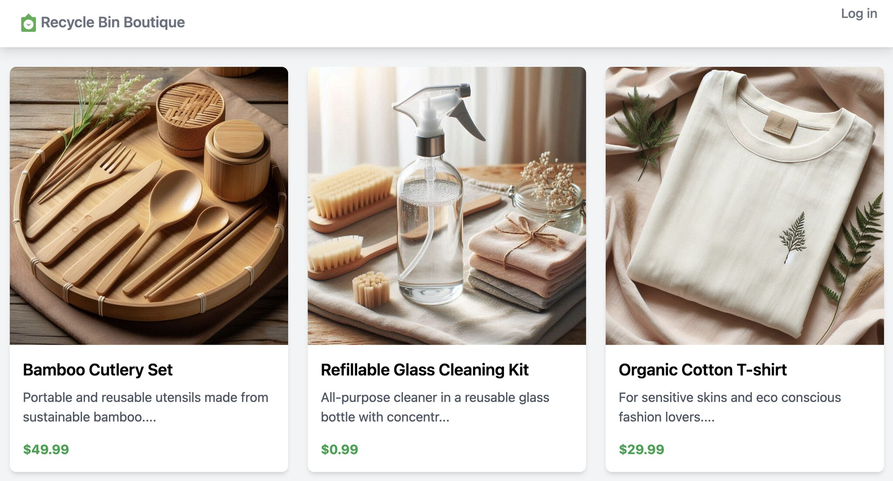

# The Recycle Bin Boutique
An online store demo to showcase the capabilites of AWS Edge Services, mainly CloudFront and AWS WAF. Please note that this project is currently under development, and it's not the final version.


# How to deploy

```javascript
git clone https://github.com/achrafsouk/recycle-bin-boutique.git
cd recycle-bin-boutique/store-infra
npm install
cdk deploy
```

# Architecture

The backend includes:
* A nextJS based SSR application hosted on an EC2 instance.
* DynamoDB tables to store user and product information
* S3 bucket to store product images

It is exposed to the internet using CloudFront, with a WAF WEbACL.


# AWS WAF testing scenarios

Navigate to scripts folder using the ```cd scripts``` command, then go through the different testing scenarios, and make sure that you replace the CloudFront domain name in the commands with the one in the CDK deployment output.

| Threat category  | Test scenario  | How to test | 
|:------------- |:--------------- | :-------------|
| **DDoS** | Reduce attack surface of backend| Go to the deployed EC2 instance (_store_backend_ec2_), and try to load the page on port 3000. Connection will be refused, since only CloudFront IPs are allowed to using CloudFront prefixlist in its security group. | 
| **DDoS** | Reduce attack surface of APIs| Some APIs in the backend are only meant to be used by NextJS when rendering the page on the server side. Navigate to one of these APIs (e.g. /api/profile, api/products, api/product) and verify that you are blocked. | 
| **DDoS** | Malicious IPs | Load the website using a VPN proxy site (e.g. https://www.blockaway.net), and verify that the page is blocked. Note that this might not happen all the time as VPN operators constantly change their IPs.|
| **DDoS** | Rate limit with 400 threshold | Run the following bash script, and verify how AWS WAF blocks an IP after threshold is breached within tens of seconds. Since the page does not exist, 404 response is returned, then a 202 challenge request is returned by the subsequent rules, and finally this rule will block with 403 <br/> ```bash rate-limit-test.sh https://xxxxxxxx.cloudfront.net/non_existing_page 400``` |
| **Web Scraping** | User-Agent classification | Run the following curl, and verify that WAF detects and blocks this HTTP library: <br/> ```curl -I https://xxxxxxxx.cloudfront.net/``` |
| **Web Scraping** | HTTP library detection | Execute the following curl and verify that a 202 javascript challenge is returned to force the acquisition of a token after multiple attempts without it from the same IP: <br/> ```for i in {1..30}; do curl -I --include --silent https://xxxxxxxx.cloudfront.net/ -H 'User-Agent: Mozilla/5.0 (Windows NT 10.0; Win64; x64) AppleWebKit/537.36 (KHTML, like Gecko) Chrome/123.0.0.0 Safari/537.36' \| grep -e HTTP/ -e x-amzn-waf-action; done``` <br/> Load the page using another browser to see the silent challenge in action|
| **Web Scraping** | Token detection replay | Load the home page in a browser, copy the token, and then run the following curl after replacing the cookie with the token value in AWS Cloud Shell in different refions. Verify that a 202 challenge is returned to force the acquisition of a token: <br/> ```curl -I --include --silent https://xxxxxxxx.cloudfront.net/ -H 'User-Agent: Mozilla/5.0 (Windows NT 10.0; Win64; x64) AppleWebKit/537.36 (KHTML, like Gecko) Chrome/123.0.0.0 Safari/537.36' -H 'Cookie: aws-waf-token=YOUR_TOKEN_VALUE'```|
| **Web Scraping** | Automation framework detection | Launch a headless chrome based on Selenium using the following command, and make sure that the scraper is not able to parse product page info: <br/> ```npm install``` <br/> ```node selenium.js https://xxxxxxxx.cloudfront.net/```|
| **Credential Stuffing** | Fetch login api wihtout a token using curl | Update the CloudFront domain name in the following curl, then execute it in bash, and verify that a 403 block is returned: <br/> ```curl -d '{username: "Joe", password: "hackedpwd"}' -H "Content-Type: application/json" -X POST https://xxxxxxxx.cloudfront.net/api/login --include --silent -H 'User-Agent: Mozilla/5.0 (Windows NT 10.0; Win64; x64) AppleWebKit/537.36 (KHTML, like Gecko) Chrome/123.0.0.0 Safari/537.36' \| grep -e HTTP/ -e x-amzn-waf-action``` |
| **Credential Stuffing** | Stolen credential detection | Use the following test credentials and verify that the api returns 403 block  <br/> ```WAF_TEST_CREDENTIAL@wafexample.com``` <br/> ```WAF_TEST_CREDENTIAL_PASSWORD``` |
| **Credential Stuffing** | Password traversal detection | Using the same username, e.g. joe, login with different passwords 10-20 times until the api call returns 403 |
| **Fake Account Creation** | Use a session to create many accounts | Try to create multiple acounts in the website, and verify a block after a multiple successful attempts |

npm run install

# Troubleshooting

If the backend is not reachable, connect to the EC2 instance using the AWS console, and use any of the following commands:

```
pm2 list
pm2 restart nextjs-app
pm2 start npm --name nextjs-app -- run start -- -p 3000

cat /var/log/cloud-init.log and
cat /var/log/cloud-init-output.log

fields @timestamp, @message
| sort @timestamp desc
| filter httpRequest.requestId = ' UW9-AA4dRZVxrLJeVEWIoXt-8mZ98b7gfYH-NhXJhgwIG76HymvrOw=='
| limit 20
```

# TODO / Roadmap
* Refactor nextjs app code
* Refactor infra code
* Add ico icon
* Script to generate data and populate the store
* Managing cart actions
* Image optimization
* A/B testing  with rule engine
* WAF logging
